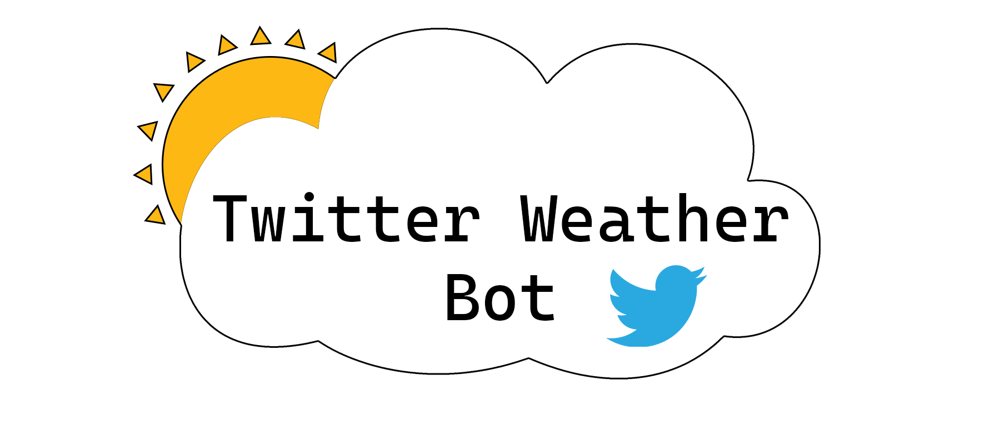
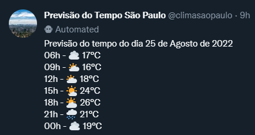

# ⛅ Twitter Weather Bot
This repository contains code to run a Python bot that posts a tweet with the daily weather forecast for a particular city. The weather data is obtained from the [**Open Weather API**](https://openweathermap.org/api).

Here is the account that I set up to run this bot:

<a href = "https://twitter.com/climasaopaulo">  </a>

It tweets about the weather forecast for the day for the city of São Paulo in Brazil.

# 🖥️ Installation Guide
Before starting, you should obtain elevated access to the Twitter API if you do not already have it. You can get it at [**Twitter's developers portal**](https://developer.twitter.com/). You will also need an API key to obtain data from Open Weather. You can get one by signing up for free on their [website](https://openweathermap.org/price).

Clone the repository
```
git clone https://github.com/viniciusenari/twitter-profile-updater
```
Create a virtual environment.
```
python -m venv path/to/your-env
```

Activate your virtual environment. On Windows:
```
your-env\Scripts\activate
```

On Unix or macOS:
```
source your-env/bin/activate
```

Install dependencies
```
pip install -r requirements
```

# 🐦 How to use
Change the name of the [.env.example](https://github.com/viniciusenari/weather-bot/blob/main/.env.example) file to .env and fill your API's keys and access tokens.
```py
API_KEY = "YOUR_TWITTER_API_KEY"
API_KEY_SECRET = "YOUR_TWITTER_API_KEY_SECRET"
ACCESS_TOKEN = "YOUR_TWITTER_ACCESS_TOKEN"
ACCESS_TOKEN_SECRET = "YOUR_TWITTER_ACCESS_TOKEN_SECRET"
WEATHER_API_KEY = "YOUR_OPEN_WEATHER_API_KEY"
```
If you want to change the bot to post the forecast for a specific city or region, change the latitude (`lat`) and longitude (`lon`) parameters on `weather.get_data()`. You can also change the unit of measurement from Celsius to Fahrenheit by changing the `units` parameter from metric to imperial. This is called on [**main.py**](https://github.com/viniciusenari/weather-bot/blob/main/main.py) **line 17**.
```py
weather.get_data(lat = "-23.55", lon = "-46.64", units="metric")
```
On [**projects/weather.py**](https://github.com/viniciusenari/weather-bot/blob/main/project/weather.py) **line 21**, you may change the tweet message.
```py
def create_tweet(self):
    text = f'Previsão do tempo do dia {format_day(self.forecast[0]["datetime"].date())}\n'
    for data in self.forecast:
        text += f'{data["datetime"].time().strftime("%H")}h - {data["icon"]} {data["temperature"] :.0f}°C \n'

    return text
```
You may also change the months name on [utils.py](https://github.com/viniciusenari/weather-bot/blob/main/project/utils.py) **line 40**. By default they are in Portuguese.
```py
months_name = {'01' : 'Janeiro',
        '02' : 'Fevereiro',
        '03' : 'Março',
        '04' : 'Abril',
        '05' : 'Maio',
        '06' : 'Junho',
        '07' : 'Julho',            
        '08' : 'Agosto',    
        '09' : 'Setembro',
        '10' : 'Outubro',
        '11' : 'Novembro',
        '12' : 'Dezembro'
    }
```
Run **main.py** to get the data and post a tweet.
```
python main.py
```
Here is an example of how the tweet post will look like:


There are limited endpoints one can make requests for free on the Open Weather API. I'm using both the [**Current Wheater**](https://openweathermap.org/current) and the [**5-day / 3-hour forecast**](https://openweathermap.org/forecast5). The current weather I use to get the first hour data (6 am on the example). The 5-day/ 3-hour forecast provides a forecast for the next five days with a 3-hour step starting from the next step that is more than 3 hours ahead. I take the next six measurements from this endpoint.

Finally, you can set up a cloud scheduler to run this script daily, and your bot account will make posts about the weather forecast every day.